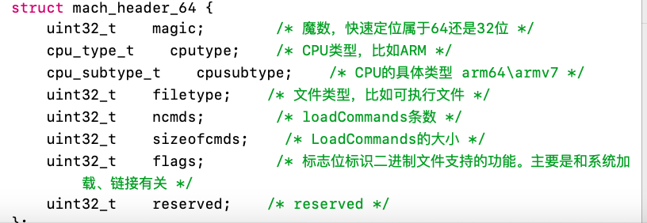
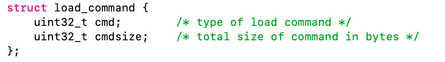

##应用启动流程

[dyld详解](https://www.dllhook.com/post/238.html)


Mach-O文件：

Mach-O文件分为:Header.LoadCommands.Data这三大部分.

header:



Load Commands:

loadCommands中记录了很多信息,包括动态链接器(比如dyld)的位置,程序的入口地址(main),依赖库的信息,代码的位置.符号表的位置等等.


DATA:

在loadCommands后就是Data区域,这个区域存储了我们具体的只读代码及可读写的代码,比如我们的方法,符号表字符表,代码数据,链接器所需要的数据比如重定向,符号绑定等等,这里存储的是具体的数据


###dyld加载流程:
程序是从dyld.start开始调用dyld.main()函数

1. 检查环境变量并设置运行环境

 ```
 checkEnvironmentVariables
 ```
2. 加载共享缓存
 
 ```
 checkSharedRegionDisable((mach_header*)mainExecutableMH)
 ```
 而mapSharedCache()里面实则是调用了loadDyldCache()，共享缓存加载又分为三种情况：
 - 仅加载到当前进程，调用mapCachePrivate()。
 - 共享缓存已加载，不做任何处理。
 - 当前进程首次加载共享缓存，调用mapCacheSystemWide()。
 
3. 实例化主程序

 将主程序的Mach-O加载进内存，并实例化一个ImageLoader。instantiateFromLoadedImage()首先调用isCompatibleMachO()检测Mach-O头部的magic、cputype、cpusubtype等相关属性，判断Mach-O文件的兼容性，如果兼容性满足，则调用ImageLoaderMachO::instantiateMainExecutable()实例化主程序的ImageLoader

 ```
 static ImageLoaderMachO* instantiateFromLoadedImage(const macho_header* mh, uintptr_t slide, const char* path)
{
  // try mach-o loader
  // 尝试加载MachO
  if ( isCompatibleMachO((const uint8_t*)mh, path) ) {
    ImageLoader* image = ImageLoaderMachO::instantiateMainExecutable(mh, slide, path, gLinkContext);
    addImage(image);
    return (ImageLoaderMachO*)image;
  }
  
  throw "main executable not a known format";
}
 ```
4. 加载插入的动态库

 加载环境变量DYLD_INSERT_LIBRARIES中配置的动态库，先判断环境变量DYLD_INSERT_LIBRARIES中是否存在要加载的动态库，如果存在则调用loadInsertedDylib()依次加载

 ```
 for (const char* const* lib = sEnv.DYLD_INSERT_LIBRARIES; *lib != NULL; ++lib)
                loadInsertedDylib(*lib);
 ```
 loadInsertedDylib()内部设置了一个LoadContext参数后，调用了load()函数，
5. 链接主程序

 ```
 if ( mainExcutableAlreadyRebased ) {
            // previous link() on main executable has already adjusted its internal pointers for ASLR
            // work around that by rebasing by inverse amount
            sMainExecutable->rebase(gLinkContext, -mainExecutableSlide);
        }
 ```
6. 链接插入的动态库
7. 执行弱符号绑定
8. 执行初始化方法

 这一步由initializeMainExecutable()完成。dyld会优先初始化动态库，然后初始化主程序。该函数首先执行runInitializers()，内部再依次调用processInitializers()、recursiveInitialization()。我们在recursiveInitialization()函数里找到了notifySingle()函数：
 
 ```
 context.notifySingle(dyld_image_state_dependents_initialized, this, &timingInfo);
 ```
 通过添加符号化断点从调用栈看到是libobjc.A.dylib的_objc_init函数调用了_dyld_objc_notify_register()
 
 在_objc_init注册的init回调函数就是load_images()，回调里面调用了call_load_methods()来执行所有的+ load方法。 
 
9. 查找入口点并返回

 调用主程序镜像的getThreadPC()，从加载命令读取LC_MAIN入口，如果没有LC_MAIN就调用getMain()读取LC_UNIXTHREAD，找到后就跳到入口点指定的地址并返回。
 
 
##启动优化
###min函数执行之前

- 动态库加载越多，启动越慢。
- ObjC类越多，启动越慢 --- 合并Category和功能类似的类
- C的constructor函数越多，启动越慢
- C++静态对象越多，启动越慢
- ObjC的+load越多，启动越慢
    
###main阶段的优化
- 执行applicationWillFinishLaunching的耗时
- rootViewController及其childViewController的加载、view及其subviews的加载

### 深度优化


